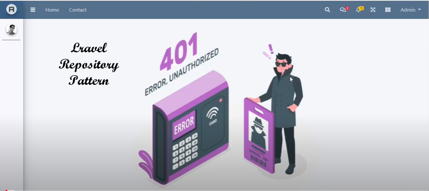
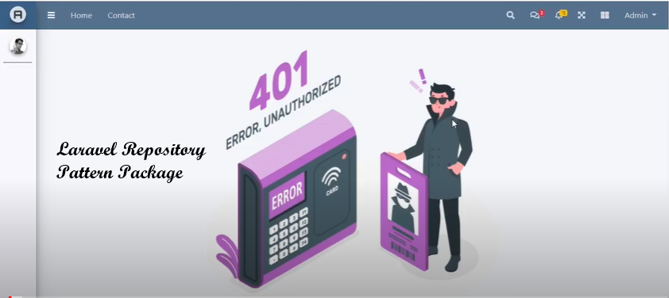

  ##  Overview

<!--  -->

    
    

<h2>  About Me </h2>

  

  - 🔭  Diligent programmer with around 2 years of experience
  - 👯  Laravel is my core coding framework for PHP.
  - 💬  Code high-performance programs in Laravel with the standard way of building applications using SDLC, DRY, and SOLID Design Principles.

  ##  Technologies 

  
  
  
  
  
  
  
  
  
  
  
  
  
  
  
  
  
  
  

  

  ##  Youtube video

  
  

  ##  Conect with me
  

  
  
  
  
  

